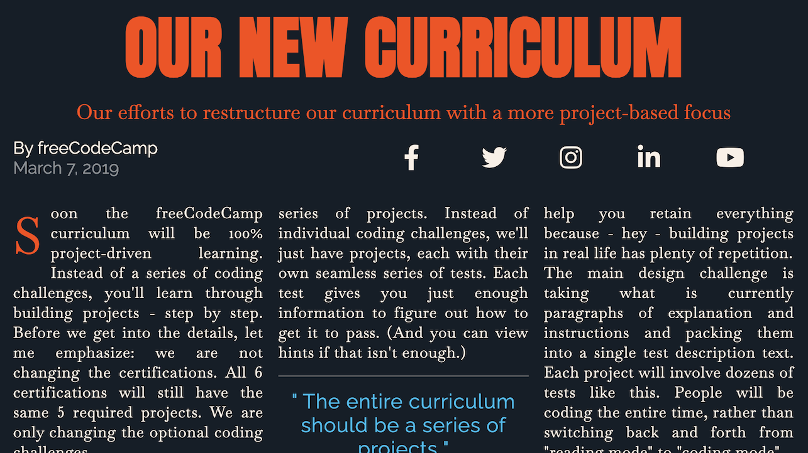

# Build a Magazine

Following along with freeCodeCamp's _[Learn CSS Grid by Building a Magazine](https://www.freecodecamp.org/learn/2022/responsive-web-design/#learn-css-grid-by-building-a-magazine)_ lesson – part of the **Responsive Web Design** curriculum.

**Codepen:** https://codepen.io/ell8031/pen/NWZjPOW

#### Course description
> _CSS Grid gives you control over the rows and columns of your webpage design._
>
> _In this course, you'll build a magazine article. You'll learn how to use CSS Grid, including concepts like grid rows and grid columns._

#### Preview:

